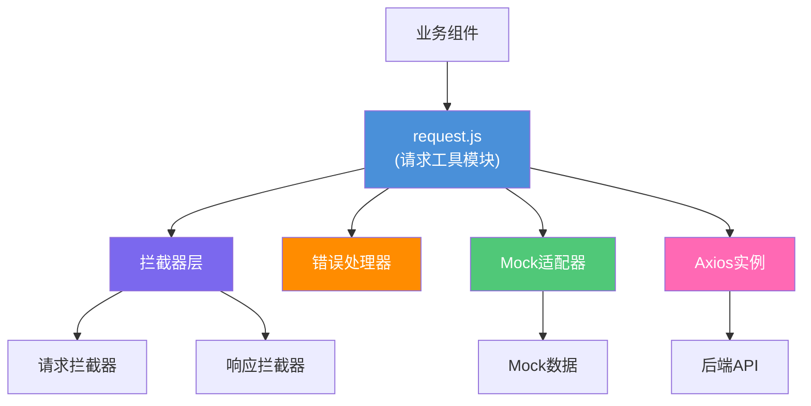

# 前端请求处理模块技术设计文档

> **关联需求**：[前端请求处理模块需求文档](../01-product-specs/frontend-request-handler-spec.md)  
> **文档状态**：草稿  
> **创建时间**：2026-06-16  
> **最后更新**：2026-06-16  
> **负责人**：@dev

---

## 概述

基于Axios封装统一的HTTP请求处理模块，提供请求/响应拦截器、错误处理、超时管理和Mock数据支持，实现前后端数据交互的标准化和统一管理。

---

## 架构设计

### 组件关系图



### 数据流向

**请求流程**：

1. 业务组件调用 `request.get/post/put/delete` 方法
2. 请求拦截器处理：添加认证令牌、设置请求头、记录日志
3. 检查Mock模式：如果是Mock模式，返回Mock数据
4. 发送HTTP请求到后端API
5. 响应拦截器处理：统一响应格式、错误处理、数据转换
6. 返回处理后的数据给业务组件

**错误处理流程**：

1. HTTP请求失败（网络错误、超时等）
2. 响应拦截器捕获错误
3. 错误处理器分类错误类型
4. 根据错误类型显示用户提示
5. 返回rejected Promise

**令牌刷新流程**：

1. 请求拦截器检测令牌即将过期
2. 暂停当前请求
3. 发起令牌刷新请求
4. 刷新成功，更新本地令牌
5. 重新发送原始请求
6. 返回响应数据

---

## 接口定义

### request.js API

**基础配置**：

```javascript
// 创建axios实例
const request = axios.create({
  baseURL: process.env.VUE_APP_API_BASE_URL || '/api',
  timeout: 10000,
  headers: {
    'Content-Type': 'application/json',
    'Accept': 'application/json'
  }
})
```

**请求方法**：

| 方法名 | 参数 | 返回值 | 说明 |
|--------|------|--------|------|
| get(url, config?) | url: string, config?: AxiosRequestConfig | Promise<any> | GET请求 |
| post(url, data?, config?) | url: string, data?: any, config?: AxiosRequestConfig | Promise<any> | POST请求 |
| put(url, data?, config?) | url: string, data?: any, config?: AxiosRequestConfig | Promise<any> | PUT请求 |
| delete(url, config?) | url: string, config?: AxiosRequestConfig | Promise<any> | DELETE请求 |
| setMockMode(enabled) | enabled: boolean | void | 设置Mock模式 |
| setAuthToken(token) | token: string | void | 设置认证令牌 |

**使用示例**：

```javascript
// GET请求
const users = await request.get('/users', {
  params: { page: 1, size: 10 }
})

// POST请求
const newUser = await request.post('/users', {
  name: '张三',
  email: 'zhangsan@example.com'
})

// 带自定义配置的请求
const data = await request.get('/data', {
  timeout: 5000,
  headers: {
    'X-Custom-Header': 'value'
  }
})
```

### 拦截器接口

**请求拦截器**：

```javascript
request.interceptors.request.use(
  (config) => {
    // 添加认证令牌
    const token = getToken()
    if (token) {
      config.headers.Authorization = `Bearer ${token}`
    }
    
    // 添加请求ID用于日志追踪
    config.headers['X-Request-ID'] = generateRequestId()
    
    // 记录请求日志
    logRequest(config)
    
    return config
  },
  (error) => {
    return Promise.reject(error)
  }
)
```

**响应拦截器**：

```javascript
request.interceptors.response.use(
  (response) => {
    // 统一处理响应格式
    const { data, code, message } = response.data
    
    // 业务成功
    if (code === 200 || code === 201) {
      return data
    }
    
    // 业务失败
    showError(message)
    return Promise.reject(new Error(message))
  },
  (error) => {
    // 处理HTTP错误
    return handleHttpError(error)
  }
)
```

### Mock接口

**Mock配置**：

```javascript
const mockConfig = {
  enabled: process.env.VUE_APP_MOCK_ENABLED === 'true',
  delay: 500, // 模拟网络延迟
  data: {
    '/api/users': {
      method: 'get',
      response: () => ({
        code: 200,
        data: [
          { id: 1, name: '张三' },
          { id: 2, name: '李四' }
        ]
      })
    }
  }
}
```

**Mock使用示例**：

```javascript
// 启用Mock模式
request.setMockMode(true)

// 请求会返回Mock数据
const users = await request.get('/api/users')
```

---

## 数据模型

### 请求配置对象

**RequestConfig**：

| 字段名 | 类型 | 必填 | 默认值 | 说明 |
|--------|------|------|--------|------|
| url | string | 是 | — | 请求URL |
| method | string | 否 | GET | HTTP方法 |
| baseURL | string | 否 | — | 基础URL |
| headers | object | 否 | {} | 请求头 |
| params | object | 否 | {} | URL参数 |
| data | object | 否 | {} | 请求体 |
| timeout | number | 否 | 10000 | 超时时间(ms) |
| withCredentials | boolean | 否 | false | 跨域携带cookie |

### 响应数据对象

**ResponseData**：

| 字段名 | 类型 | 说明 |
|--------|------|------|
| code | number | 业务状态码 |
| message | string | 响应消息 |
| data | any | 响应数据 |

### 错误对象

**ErrorObject**：

| 字段名 | 类型 | 说明 |
|--------|------|------|
| code | number | 错误码 |
| message | string | 错误消息 |
| type | string | 错误类型：NETWORK/HTTP/BUSINESS/TIMEOUT |
| config | object | 请求配置 |
| response | object | 响应对象（HTTP错误） |

---

## 技术选型

| 技术 | 版本 | 用途 | 选择理由 |
|------|------|------|----------|
| Axios | 1.x | HTTP客户端 | 支持拦截器、请求取消、类型定义完善 |
| Vue 3 | 3.x | 前端框架 | 项目统一技术栈，响应式数据绑定 |
| TypeScript | 5.x | 类型系统 | 提供类型安全，减少运行时错误 |
| Mock.js | 1.x | Mock数据 | 生成随机数据，模拟API响应 |
| Element Plus | 2.x | UI组件库 | 提供消息提示、加载等UI组件 |

---

## 核心功能实现

### 1. 请求拦截器

**功能**：
- 自动添加JWT认证令牌
- 添加通用请求头
- 请求日志记录
- 令牌过期检测和刷新

**实现要点**：

```javascript
// 令牌刷新逻辑
let isRefreshing = false
let refreshSubscribers = []

function subscribeTokenRefresh(callback) {
  refreshSubscribers.push(callback)
}

function onRefreshed(token) {
  refreshSubscribers.forEach(callback => callback(token))
  refreshSubscribers = []
}

async function refreshToken() {
  try {
    const response = await axios.post('/api/v1/auth/refresh', {
      refreshToken: getRefreshToken()
    })
    const { accessToken } = response.data
    setToken(accessToken)
    return accessToken
  } catch (error) {
    clearToken()
    window.location.href = '/login'
    throw error
  }
}
```

### 2. 响应拦截器

**功能**：
- 统一响应格式处理
- 业务错误处理
- HTTP错误分类处理
- 自动重试机制

**错误分类**：

```javascript
function handleHttpError(error) {
  if (error.response) {
    // 服务器返回错误响应
    const { status, data } = error.response
    
    switch (status) {
      case 401:
        handleUnauthorized()
        break
      case 403:
        showErrorMessage('没有权限访问')
        break
      case 404:
        showErrorMessage('请求的资源不存在')
        break
      case 500:
        showErrorMessage('服务器错误，请稍后重试')
        break
      default:
        showErrorMessage(data.message || '请求失败')
    }
  } else if (error.request) {
    // 请求已发送但没有收到响应
    if (error.code === 'ECONNABORTED') {
      showErrorMessage('请求超时，请检查网络连接')
    } else {
      showErrorMessage('网络连接失败，请检查网络设置')
    }
  } else {
    // 请求配置错误
    showErrorMessage('请求配置错误')
  }
  
  return Promise.reject(error)
}
```

### 3. 超时管理

**功能**：
- 统一超时设置
- 超时自动重试
- 超时错误提示

**实现要点**：

```javascript
// 重试配置
const retryConfig = {
  retries: 3,
  retryDelay: 1000,
  retryCondition: (error) => {
    return (
      error.code === 'ECONNABORTED' ||
      error.message.includes('timeout') ||
      !error.response
    )
  }
}

// 重试拦截器
axiosRetry(axios, retryConfig)
```

### 4. Mock数据支持

**功能**：
- Mock模式切换
- Mock数据定义
- Mock响应延迟模拟

**实现要点**：

```javascript
// Mock适配器
function mockAdapter(config) {
  const { url, method } = config
  const mockRule = mockConfig.data[url]
  
  if (!mockRule || mockRule.method.toLowerCase() !== method.toLowerCase()) {
    return Promise.reject(new Error('Mock data not found'))
  }
  
  return new Promise((resolve) => {
    setTimeout(() => {
      resolve({
        data: mockRule.response(),
        status: 200,
        statusText: 'OK',
        headers: {},
        config
      })
    }, mockConfig.delay)
  })
}

// 条件性使用Mock适配器
if (mockConfig.enabled) {
  request.defaults.adapter = mockAdapter
}
```

### 5. 错误处理

**功能**：
- 统一错误提示
- 错误日志记录
- 错误上报

**实现要点**：

```javascript
// 错误处理器
class ErrorHandler {
  static handle(error) {
    const errorInfo = this.parseError(error)
    this.showUserMessage(errorInfo)
    this.logError(errorInfo)
    this.reportError(errorInfo)
  }
  
  static parseError(error) {
    return {
      type: this.getErrorType(error),
      code: error.response?.status,
      message: this.getErrorMessage(error),
      url: error.config?.url,
      timestamp: new Date().toISOString()
    }
  }
  
  static getErrorType(error) {
    if (error.code === 'ECONNABORTED') return 'TIMEOUT'
    if (!error.response) return 'NETWORK'
    if (error.response.status >= 500) return 'SERVER'
    if (error.response.status === 401) return 'AUTH'
    return 'HTTP'
  }
  
  static showUserMessage(errorInfo) {
    const messages = {
      TIMEOUT: '请求超时，请检查网络连接',
      NETWORK: '网络连接失败，请检查网络设置',
      AUTH: '登录已过期，请重新登录',
      SERVER: '服务器错误，请稍后重试',
      HTTP: errorInfo.message || '请求失败'
    }
    
    ElMessage.error(messages[errorInfo.type] || '请求失败')
  }
}
```

---

## 配置管理

### 环境变量

```bash
# .env.development
VUE_APP_API_BASE_URL=http://localhost:8080/api
VUE_APP_MOCK_ENABLED=false
VUE_APP_REQUEST_TIMEOUT=10000

# .env.production
VUE_APP_API_BASE_URL=https://api.example.com
VUE_APP_MOCK_ENABLED=false
VUE_APP_REQUEST_TIMEOUT=10000

# .env.mock
VUE_APP_API_BASE_URL=http://localhost:8080/api
VUE_APP_MOCK_ENABLED=true
VUE_APP_REQUEST_TIMEOUT=1000
```

### 默认配置

```javascript
const defaultConfig = {
  baseURL: process.env.VUE_APP_API_BASE_URL,
  timeout: parseInt(process.env.VUE_APP_REQUEST_TIMEOUT) || 10000,
  headers: {
    'Content-Type': 'application/json',
    'Accept': 'application/json'
  },
  // 请求重试配置
  retry: {
    retries: 3,
    retryDelay: 1000
  },
  // Mock配置
  mock: {
    enabled: process.env.VUE_APP_MOCK_ENABLED === 'true',
    delay: 500
  }
}
```

---

## 风险与注意事项

### 技术风险

| 风险 | 影响程度 | 概率 | 应对策略 |
|------|----------|------|----------|
| 令牌刷新并发问题 | 中 | 中 | 使用刷新锁，避免并发刷新 |
| Mock数据不一致 | 低 | 中 | 定期同步Mock数据和API定义 |
| 拦截器性能影响 | 低 | 低 | 优化拦截器逻辑，避免复杂计算 |
| 错误处理遗漏 | 中 | 低 | 完善错误分类，添加默认处理 |

### 注意事项

1. **令牌安全**：JWT令牌只在内存中使用，不在localStorage中存储敏感信息
2. **请求去重**：避免短时间内重复请求相同资源
3. **内存泄漏**：及时清理订阅和定时器
4. **类型安全**：使用TypeScript定义接口类型
5. **日志脱敏**：不在日志中记录敏感信息（密码、令牌）
6. **性能监控**：记录请求耗时，监控慢请求

---

## 测试策略

| 测试类型 | 测试内容 | 测试框架 | 覆盖场景 |
|----------|---------|----------|----------|
| 单元测试 | 拦截器、错误处理器 | Jest + Vue Test Utils | 正常流程、异常处理 |
| 集成测试 | 完整请求流程 | Jest + axios-mock-adapter | 请求发送、响应处理 |
| Mock测试 | Mock数据返回 | Jest | Mock模式切换、数据格式 |
| E2E测试 | 真实API交互 | Cypress | 端到端请求流程 |

---

## 变更记录

| 版本 | 日期 | 变更内容 | 变更人 |
|------|------|----------|--------|
| v1.0 | 2026-06-16 | 初始版本 | @dev |