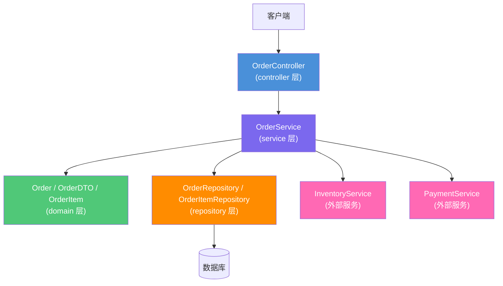
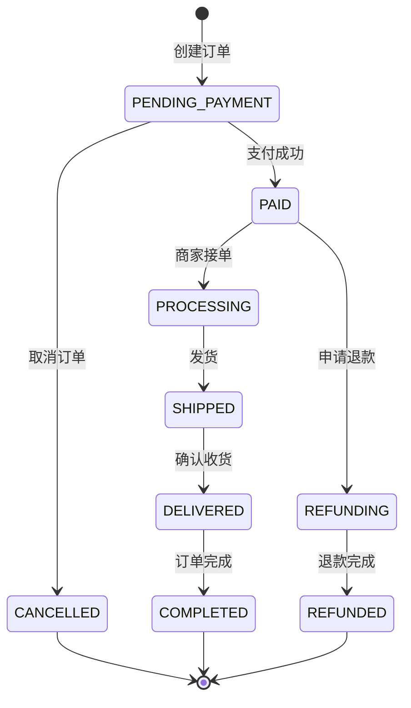

# 订单管理模块技术设计文档

> **关联需求**：[订单管理模块需求文档](../01-product-specs/order-management-spec.md)  
> **文档状态**：草稿  
> **创建时间**：2026-06-16  
> **最后更新**：2026-06-16  
> **负责人**：@dev

---

## 概述

基于Spring Boot + MyBatis Plus实现订单管理模块，采用标准四层架构，提供完整的CRUD接口，支持分页查询、条件筛选、事务管理和数据一致性保证。

---

## 架构设计

### 组件关系图



### 数据流向

**请求处理流程**：

1. 客户端发送HTTP请求到 `OrderController`
2. Controller 接收请求参数，调用参数校验（`@Valid`）
3. Controller 将请求DTO传递给 `OrderService`
4. Service 执行业务逻辑，调用 `OrderRepository` 进行数据操作
5. Repository 与数据库交互，返回实体对象
6. Service 将实体对象转换为响应DTO
7. Controller 将响应DTO包装为统一响应格式返回

**事务处理流程**：

1. Service方法标注 `@Transactional`
2. 开始事务，执行数据库操作
3. 调用库存服务扣减库存
4. 调用支付服务创建支付记录
5. 所有操作成功，提交事务
6. 任一操作失败，回滚事务

**异常处理流程**：

1. Service 或 Repository 抛出业务异常（`OrderException`）
2. 全局异常处理器（`GlobalExceptionHandler`）捕获异常
3. 事务自动回滚
4. 返回标准错误响应格式

---

## 接口定义

### REST API

**基础路径**：`/api/v1/orders`

| 方法 | 路径 | 描述 | 认证 | 请求体 | 响应体 |
|------|------|------|------|--------|--------|
| GET | `/api/v1/orders/{id}` | 根据ID查询订单详情 | 需要 | — | `OrderDetailResponse` |
| GET | `/api/v1/orders` | 分页查询订单列表 | 需要 | — | `Page<OrderSummaryResponse>` |
| POST | `/api/v1/orders` | 创建新订单 | 需要 | `CreateOrderRequest` | `OrderDetailResponse` |
| PUT | `/api/v1/orders/{id}/status` | 更新订单状态 | 需要（管理员） | `UpdateOrderStatusRequest` | `OrderDetailResponse` |
| DELETE | `/api/v1/orders/{id}` | 删除订单 | 需要（管理员） | — | — |

#### 接口详情：GET /api/v1/orders

**描述**：分页查询订单列表，支持筛选和排序

**请求参数**：

| 参数名 | 位置 | 类型 | 必填 | 描述 |
|--------|------|------|------|------|
| page | query | Integer | 否 | 页码，默认1 |
| size | query | Integer | 否 | 每页大小，默认10，最大100 |
| status | query | String | 否 | 订单状态筛选 |
| sortBy | query | String | 否 | 排序字段，默认createdAt |
| sortOrder | query | String | 否 | 排序方向，asc/desc，默认desc |

**响应示例（200 OK）**：

```json
{
  "code": 200,
  "message": "success",
  "data": {
    "content": [
      {
        "id": 1,
        "orderNo": "ORD202606160001",
        "totalAmount": 299.00,
        "status": "PENDING_PAYMENT",
        "itemCount": 2,
        "createdAt": "2026-06-16T10:00:00Z"
      }
    ],
    "pageable": {
      "pageNumber": 1,
      "pageSize": 10,
      "totalPages": 5,
      "totalElements": 50
    }
  }
}
```

#### 接口详情：POST /api/v1/orders

**描述**：创建新订单

**请求体**：

```json
{
  "shippingAddress": {
    "receiverName": "张三",
    "phone": "13800138000",
    "province": "北京市",
    "city": "北京市",
    "district": "朝阳区",
    "detailAddress": "某某街道123号",
    "postalCode": "100000"
  },
  "paymentMethod": "ALIPAY",
  "items": [
    {
      "productId": 1,
      "quantity": 2,
      "price": 99.00
    },
    {
      "productId": 2,
      "quantity": 1,
      "price": 101.00
    }
  ],
  "remark": "请尽快发货"
}
```

**请求体字段说明**：

| 字段名 | 类型 | 必填 | 校验规则 | 描述 |
|--------|------|------|----------|------|
| shippingAddress | Object | 是 | @Valid | 收货地址 |
| paymentMethod | String | 是 | @NotBlank | 支付方式：ALIPAY/WECHAT/UNIONPAY |
| items | Array | 是 | @NotEmpty, @Size(min=1) | 订单商品列表 |
| remark | String | 否 | @Size(max=500) | 订单备注 |

**响应示例（201 Created）**：

```json
{
  "code": 201,
  "message": "订单创建成功",
  "data": {
    "id": 1,
    "orderNo": "ORD202606160001",
    "totalAmount": 299.00,
    "status": "PENDING_PAYMENT",
    "items": [
      {
        "productId": 1,
        "productName": "商品A",
        "quantity": 2,
        "price": 99.00,
        "subtotal": 198.00
      }
    ],
    "shippingAddress": {
      "receiverName": "张三",
      "phone": "138****8000",
      "fullAddress": "北京市北京市朝阳区某某街道123号"
    },
    "createdAt": "2026-06-16T10:00:00Z"
  }
}
```

#### 接口详情：PUT /api/v1/orders/{id}/status

**描述**：更新订单状态（仅管理员）

**请求体**：

```json
{
  "status": "PAID",
  "remark": "用户已完成支付"
}
```

**响应示例（200 OK）**：

```json
{
  "code": 200,
  "message": "订单状态更新成功",
  "data": {
    "id": 1,
    "orderNo": "ORD202606160001",
    "status": "PAID",
    "statusHistory": [
      {
        "status": "PENDING_PAYMENT",
        "remark": "订单创建",
        "createdAt": "2026-06-16T10:00:00Z"
      },
      {
        "status": "PAID",
        "remark": "用户已完成支付",
        "createdAt": "2026-06-16T10:05:00Z",
        "operator": "admin"
      }
    ]
  }
}
```

---

## 数据模型

### 实体类

**`Order` 实体类**（对应表：`t_order`）：

| 字段名 | Java 类型 | 数据库类型 | 约束 | 说明 |
|--------|-----------|-----------|------|------|
| id | Long | BIGINT | PK, AUTO_INCREMENT | 主键 |
| orderNo | String | VARCHAR(32) | NOT NULL, UNIQUE | 订单号 |
| userId | Long | BIGINT | NOT NULL | 用户ID |
| totalAmount | BigDecimal | DECIMAL(10,2) | NOT NULL | 订单总金额 |
| status | String | VARCHAR(32) | NOT NULL | 订单状态 |
| paymentMethod | String | VARCHAR(32) | NOT NULL | 支付方式 |
| paymentStatus | String | VARCHAR(32) | NOT NULL | 支付状态 |
| remark | String | VARCHAR(500) | NULL | 订单备注 |
| createdAt | LocalDateTime | DATETIME | NOT NULL | 创建时间 |
| updatedAt | LocalDateTime | DATETIME | NOT NULL | 更新时间 |
| deleted | Boolean | TINYINT(1) | NOT NULL, DEFAULT 0 | 逻辑删除标志 |

**`OrderItem` 实体类**（对应表：`t_order_item`）：

| 字段名 | Java 类型 | 数据库类型 | 约束 | 说明 |
|--------|-----------|-----------|------|------|
| id | Long | BIGINT | PK, AUTO_INCREMENT | 主键 |
| orderId | Long | BIGINT | NOT NULL | 订单ID |
| productId | Long | BIGINT | NOT NULL | 商品ID |
| productName | String | VARCHAR(200) | NOT NULL | 商品名称 |
| productImage | String | VARCHAR(500) | NULL | 商品图片 |
| quantity | Integer | INT | NOT NULL | 购买数量 |
| price | BigDecimal | DECIMAL(10,2) | NOT NULL | 商品单价 |
| subtotal | BigDecimal | DECIMAL(10,2) | NOT NULL | 小计金额 |
| createdAt | LocalDateTime | DATETIME | NOT NULL | 创建时间 |

**`OrderAddress` 实体类**（对应表：`t_order_address`）：

| 字段名 | Java 类型 | 数据库类型 | 约束 | 说明 |
|--------|-----------|-----------|------|------|
| id | Long | BIGINT | PK, AUTO_INCREMENT | 主键 |
| orderId | Long | BIGINT | NOT NULL, UNIQUE | 订单ID |
| receiverName | String | VARCHAR(50) | NOT NULL | 收货人姓名 |
| phone | String | VARCHAR(20) | NOT NULL | 收货人电话 |
| province | String | VARCHAR(50) | NOT NULL | 省 |
| city | String | VARCHAR(50) | NOT NULL | 市 |
| district | String | VARCHAR(50) | NOT NULL | 区 |
| detailAddress | String | VARCHAR(200) | NOT NULL | 详细地址 |
| postalCode | String | VARCHAR(10) | NULL | 邮政编码 |

**`OrderStatusHistory` 实体类**（对应表：`t_order_status_history`）：

| 字段名 | Java 类型 | 数据库类型 | 约束 | 说明 |
|--------|-----------|-----------|------|------|
| id | Long | BIGINT | PK, AUTO_INCREMENT | 主键 |
| orderId | Long | BIGINT | NOT NULL | 订单ID |
| status | String | VARCHAR(32) | NOT NULL | 订单状态 |
| remark | String | VARCHAR(500) | NULL | 备注说明 |
| operator | String | VARCHAR(50) | NULL | 操作人 |
| createdAt | LocalDateTime | DATETIME | NOT NULL | 创建时间 |

### DTO

**`CreateOrderRequest`（创建订单请求 DTO）**：

| 字段名 | Java 类型 | 校验注解 | 说明 |
|--------|-----------|---------|------|
| shippingAddress | ShippingAddressDTO | @Valid | 收货地址 |
| paymentMethod | String | @NotBlank | 支付方式 |
| items | List<OrderItemRequest> | @NotEmpty, @Size(min=1) | 订单商品 |
| remark | String | @Size(max=500) | 备注 |

**`OrderDetailResponse`（订单详情响应 DTO）**：

| 字段名 | Java 类型 | 来源字段 | 说明 |
|--------|-----------|---------|------|
| id | Long | entity.id | 订单ID |
| orderNo | String | entity.orderNo | 订单号 |
| totalAmount | BigDecimal | entity.totalAmount | 总金额 |
| status | String | entity.status | 订单状态 |
| items | List<OrderItemResponse> | orderItems | 订单商品 |
| shippingAddress | ShippingAddressResponse | orderAddress | 收货地址 |
| statusHistory | List<StatusHistoryResponse> | statusHistory | 状态历史 |

### 数据库表结构

```sql
-- 订单表
CREATE TABLE `t_order` (
    `id`              BIGINT       NOT NULL AUTO_INCREMENT COMMENT '主键',
    `order_no`        VARCHAR(32)  NOT NULL                COMMENT '订单号',
    `user_id`         BIGINT       NOT NULL                COMMENT '用户ID',
    `total_amount`    DECIMAL(10,2) NOT NULL               COMMENT '订单总金额',
    `status`          VARCHAR(32)  NOT NULL                COMMENT '订单状态',
    `payment_method`  VARCHAR(32)  NOT NULL                COMMENT '支付方式',
    `payment_status`  VARCHAR(32)  NOT NULL DEFAULT 'UNPAID' COMMENT '支付状态',
    `remark`          VARCHAR(500)                         COMMENT '订单备注',
    `created_at`      DATETIME     NOT NULL DEFAULT CURRENT_TIMESTAMP COMMENT '创建时间',
    `updated_at`      DATETIME     NOT NULL DEFAULT CURRENT_TIMESTAMP ON UPDATE CURRENT_TIMESTAMP COMMENT '更新时间',
    `deleted`         TINYINT(1)   NOT NULL DEFAULT 0       COMMENT '逻辑删除：0-正常，1-已删除',
    PRIMARY KEY (`id`),
    UNIQUE KEY `uk_order_no` (`order_no`),
    KEY `idx_user_id` (`user_id`),
    KEY `idx_status` (`status`),
    KEY `idx_created_at` (`created_at`)
) ENGINE=InnoDB DEFAULT CHARSET=utf8mb4 COMMENT='订单表';

-- 订单商品表
CREATE TABLE `t_order_item` (
    `id`             BIGINT       NOT NULL AUTO_INCREMENT COMMENT '主键',
    `order_id`       BIGINT       NOT NULL                COMMENT '订单ID',
    `product_id`     BIGINT       NOT NULL                COMMENT '商品ID',
    `product_name`   VARCHAR(200) NOT NULL                COMMENT '商品名称',
    `product_image`  VARCHAR(500)                         COMMENT '商品图片',
    `quantity`       INT          NOT NULL                COMMENT '购买数量',
    `price`          DECIMAL(10,2) NOT NULL                COMMENT '商品单价',
    `subtotal`       DECIMAL(10,2) NOT NULL                COMMENT '小计金额',
    `created_at`     DATETIME     NOT NULL DEFAULT CURRENT_TIMESTAMP COMMENT '创建时间',
    PRIMARY KEY (`id`),
    KEY `idx_order_id` (`order_id`),
    KEY `idx_product_id` (`product_id`)
) ENGINE=InnoDB DEFAULT CHARSET=utf8mb4 COMMENT='订单商品表';

-- 订单收货地址表
CREATE TABLE `t_order_address` (
    `id`              BIGINT       NOT NULL AUTO_INCREMENT COMMENT '主键',
    `order_id`        BIGINT       NOT NULL UNIQUE         COMMENT '订单ID',
    `receiver_name`   VARCHAR(50)  NOT NULL                COMMENT '收货人姓名',
    `phone`           VARCHAR(20)  NOT NULL                COMMENT '收货人电话',
    `province`        VARCHAR(50)  NOT NULL                COMMENT '省',
    `city`            VARCHAR(50)  NOT NULL                COMMENT '市',
    `district`        VARCHAR(50)  NOT NULL                COMMENT '区',
    `detail_address`  VARCHAR(200) NOT NULL                COMMENT '详细地址',
    `postal_code`     VARCHAR(10)                          COMMENT '邮政编码',
    PRIMARY KEY (`id`),
    UNIQUE KEY `uk_order_id` (`order_id`)
) ENGINE=InnoDB DEFAULT CHARSET=utf8mb4 COMMENT='订单收货地址表';

-- 订单状态历史表
CREATE TABLE `t_order_status_history` (
    `id`         BIGINT       NOT NULL AUTO_INCREMENT COMMENT '主键',
    `order_id`   BIGINT       NOT NULL                COMMENT '订单ID',
    `status`     VARCHAR(32)  NOT NULL                COMMENT '订单状态',
    `remark`     VARCHAR(500)                         COMMENT '备注说明',
    `operator`   VARCHAR(50)                          COMMENT '操作人',
    `created_at` DATETIME     NOT NULL DEFAULT CURRENT_TIMESTAMP COMMENT '创建时间',
    PRIMARY KEY (`id`),
    KEY `idx_order_id` (`order_id`),
    KEY `idx_created_at` (`created_at`)
) ENGINE=InnoDB DEFAULT CHARSET=utf8mb4 COMMENT='订单状态历史表';
```

---

## 技术选型

| 技术 | 版本 | 用途 | 选择理由 |
|------|------|------|----------|
| Spring Boot | 3.x | 应用框架 | 项目统一技术栈 |
| MyBatis Plus | 3.x | 数据访问层 | 简化CRUD操作，支持分页查询 |
| Spring Transaction | 6.x | 事务管理 | 声明式事务，保证数据一致性 |
| Lombok | 1.18.x | 代码简化 | 减少样板代码 |
| Validation | 3.x | 参数校验 | 支持声明式校验 |
| MapStruct | 1.5.x | DTO映射 | 编译期生成映射代码 |

---

## 业务逻辑

### 订单状态流转



### 订单创建流程

1. 验证用户身份和权限
2. 验证商品信息和库存
3. 计算订单总金额
4. 生成唯一订单号
5. 创建订单记录（事务开始）
6. 创建订单商品记录
7. 创建收货地址记录
8. 扣减商品库存
9. 创建支付记录
10. 记录订单状态历史
11. 提交事务

### 并发控制

1. **库存扣减**：使用乐观锁或悲观锁防止超卖
2. **订单号生成**：使用分布式ID生成器保证唯一性
3. **状态更新**：使用版本号控制并发更新

---

## 风险与注意事项

### 技术风险

| 风险 | 影响程度 | 概率 | 应对策略 |
|------|----------|------|----------|
| 库存超卖 | 高 | 中 | 使用数据库锁或分布式锁 |
| 订单重复创建 | 中 | 低 | 订单号唯一约束，幂等性设计 |
| 事务超时 | 中 | 低 | 优化事务范围，设置合理超时时间 |
| 分布式事务 | 高 | 中 | 采用最终一致性，补偿机制 |

### 注意事项

1. **事务边界**：订单创建必须在单个事务中完成
2. **数据一致性**：库存扣减和订单创建必须原子操作
3. **幂等性**：订单创建接口支持幂等性，防止重复提交
4. **异常处理**：事务失败时必须回滚，清理已创建的资源
5. **性能优化**：订单列表查询使用索引，避免全表扫描
6. **安全考虑**：用户只能访问自己的订单，管理员可访问所有订单

---

## 测试策略

| 测试类型 | 测试类 | 测试框架 | 覆盖场景 |
|----------|--------|----------|----------|
| Service 单元测试 | `OrderServiceTest` | Mockito | 正常创建、库存不足、并发创建 |
| Controller 切片测试 | `OrderControllerTest` | @WebMvcTest | 参数校验、权限控制、响应格式 |
| Repository 切片测试 | `OrderRepositoryTest` | @MybatisPlusTest | CRUD操作、分页查询、条件筛选 |
| 集成测试 | `OrderIntegrationTest` | @SpringBootTest | 完整订单流程、事务回滚、并发控制 |

---

## 变更记录

| 版本 | 日期 | 变更内容 | 变更人 |
|------|------|----------|--------|
| v1.0 | 2026-06-16 | 初始版本 | @dev |