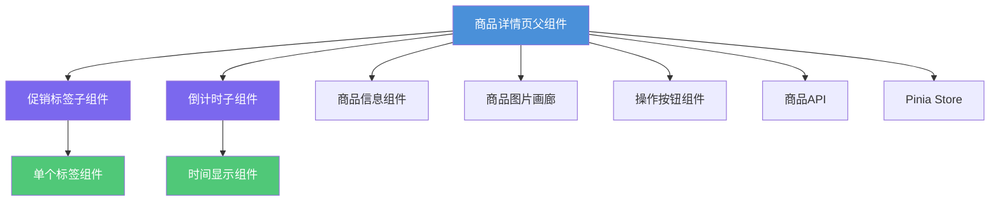
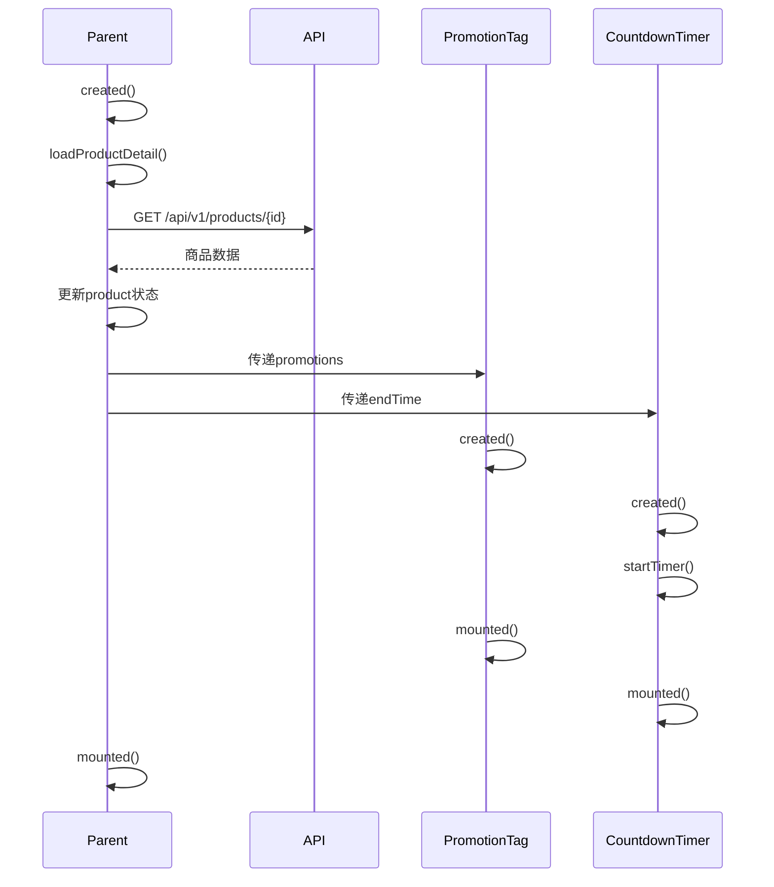
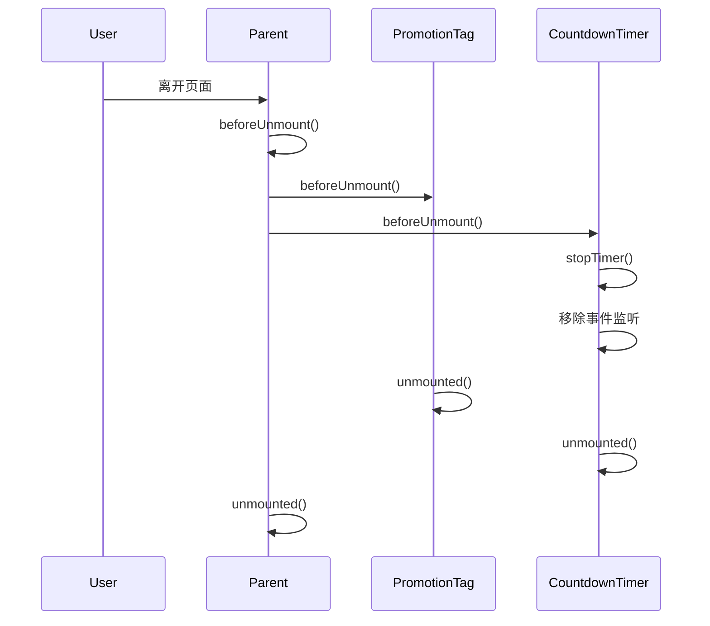

# 商品详情页组件技术设计文档

> **关联需求**：[商品详情页组件需求文档](../01-product-specs/product-detail-components-spec.md)  
> **文档状态**：草稿  
> **创建时间**：2026-06-16  
> **最后更新**：2026-06-16  
> **负责人**：@dev

---

## 概述

基于Vue 3实现商品详情页组件，包括促销标签组件和倒计时组件，采用父子组件通信模式，实现清晰的组件生命周期管理和状态更新，提供美观且用户友好的界面设计。

---

## 架构设计

### 组件关系图



### 数据流向

**父组件到子组件数据传递**：

1. 父组件从API获取商品详情数据
2. 父组件将促销信息通过props传递给促销标签组件
3. 父组件将促销结束时间通过props传递给倒计时组件
4. 子组件接收props并渲染相应内容

**子组件状态更新**：

1. 倒计时组件内部维护倒计时状态
2. 每秒更新一次倒计时显示
3. 倒计时结束时触发事件通知父组件
4. 父组件接收事件并更新商品状态

**组件生命周期管理**：

1. 父组件创建，获取商品数据
2. 子组件创建，接收props数据
3. 倒计时组件启动定时器
4. 用户离开页面，组件销毁
5. 倒计时组件清除定时器，避免内存泄漏

---

## 组件设计

### 1. ProductDetail（商品详情页父组件）

**Props**：

| 属性名 | 类型 | 必填 | 默认值 | 说明 |
|--------|------|------|--------|------|
| productId | Number | 是 | — | 商品ID |

**State**：

| 状态名 | 类型 | 初始值 | 说明 |
|--------|------|--------|------|
| product | Object | null | 商品详情数据 |
| loading | Boolean | true | 加载状态 |
| error | String | null | 错误信息 |
| promotions | Array | [] | 促销信息列表 |
| countdownEnd | Date | null | 倒计时结束时间 |

**Methods**：

```javascript
// 加载商品详情
async loadProductDetail()

// 处理倒计时结束
handleCountdownEnd()

// 处理购买操作
handleBuy()

// 处理加入购物车
handleAddToCart()
```

**Template结构**：

```vue
<template>
  <div class="product-detail">
    <!-- 加载状态 -->
    <LoadingState v-if="loading" />
    
    <!-- 错误状态 -->
    <ErrorState v-else-if="error" :message="error" @retry="loadProductDetail" />
    
    <!-- 商品详情 -->
    <div v-else class="detail-content">
      <!-- 商品图片画廊 -->
      <ProductGallery :images="product.images" />
      
      <!-- 商品信息 -->
      <div class="product-info">
        <!-- 促销标签 -->
        <PromotionTag :promotions="promotions" />
        
        <!-- 倒计时 -->
        <CountdownTimer 
          v-if="countdownEnd" 
          :end-time="countdownEnd" 
          @end="handleCountdownEnd"
        />
        
        <!-- 商品基本信息 -->
        <ProductInfo :product="product" />
        
        <!-- 操作按钮 -->
        <ActionButtons 
          @buy="handleBuy"
          @add-to-cart="handleAddToCart"
        />
      </div>
    </div>
  </div>
</template>
```

### 2. PromotionTag（促销标签子组件）

**Props**：

| 属性名 | 类型 | 必填 | 默认值 | 说明 |
|--------|------|------|--------|------|
| promotions | Array | 是 | [] | 促销信息列表 |
| maxTags | Number | 否 | 3 | 最多显示标签数 |

**Data**：

| 数据名 | 类型 | 初始值 | 说明 |
|--------|------|--------|------|
| visibleTags | Array | [] | 可见标签列表 |

**Computed**：

```javascript
// 根据优先级排序标签
sortedTags() {
  return this.promotions
    .sort((a, b) => b.priority - a.priority)
    .slice(0, this.maxTags)
}

// 是否有更多标签
hasMoreTags() {
  return this.promotions.length > this.maxTags
}
```

**Methods**：

```javascript
// 获取标签样式类
getTagClass(type) {
  const classes = {
    DISCOUNT: 'discount',
    LIMITED: 'limited',
    NEW: 'new',
    HOT: 'hot',
    GIFT: 'gift'
  }
  return classes[type] || 'default'
}

// 获取标签图标
getTagIcon(type) {
  const icons = {
    DISCOUNT: '🎉',
    LIMITED: '⏰',
    NEW: '✨',
    HOT: '🔥',
    GIFT: '🎁'
  }
  return icons[type] || ''
}
```

**Template结构**：

```vue
<template>
  <div class="promotion-tags">
    <div 
      v-for="promo in sortedTags" 
      :key="promo.id"
      :class="['tag', getTagClass(promo.type)]"
    >
      <span class="tag-icon">{{ getTagIcon(promo.type) }}</span>
      <span class="tag-text">{{ promo.text }}</span>
    </div>
    
    <div v-if="hasMoreTags" class="tag more">
      <span class="tag-text">+{{ promotions.length - maxTags }}</span>
    </div>
  </div>
</template>
```

**样式设计**：

```scss
.promotion-tags {
  display: flex;
  gap: 8px;
  margin-bottom: 16px;
  flex-wrap: wrap;
  
  .tag {
    display: inline-flex;
    align-items: center;
    padding: 4px 12px;
    border-radius: 4px;
    font-size: 12px;
    font-weight: 500;
    
    &.discount {
      background: linear-gradient(135deg, #ff6b6b, #ff8e8e);
      color: white;
    }
    
    &.limited {
      background: linear-gradient(135deg, #feca57, #ff9f43);
      color: white;
    }
    
    &.new {
      background: linear-gradient(135deg, #54a0ff, #2e86de);
      color: white;
    }
    
    &.hot {
      background: linear-gradient(135deg, #ff9ff3, #f368e0);
      color: white;
    }
    
    &.gift {
      background: linear-gradient(135deg, #1dd1a1, #10ac84);
      color: white;
    }
    
    .tag-icon {
      margin-right: 4px;
      font-size: 14px;
    }
    
    .tag-text {
      white-space: nowrap;
    }
  }
}
```

### 3. CountdownTimer（倒计时子组件）

**Props**：

| 属性名 | 类型 | 必填 | 默认值 | 说明 |
|--------|------|------|--------|------|
| endTime | Date | 是 | — | 结束时间 |
| format | String | 否 | 'DD:HH:MM:SS' | 时间格式 |
| showLabel | Boolean | 否 | true | 是否显示标签 |
| urgentThreshold | Number | 否 | 3600 | 紧急阈值（秒） |

**Events**：

| 事件名 | 参数 | 说明 |
|--------|------|------|
| end | — | 倒计时结束 |
| tick | remainingTime | 每秒触发 |

**Data**：

| 数据名 | 类型 | 初始值 | 说明 |
|--------|------|--------|------|
| remainingTime | Number | 0 | 剩余时间（秒） |
| timer | Number | null | 定时器ID |
| isUrgent | Boolean | false | 是否紧急状态 |

**Computed**：

```javascript
// 格式化的时间显示
formattedTime() {
  const days = Math.floor(this.remainingTime / 86400)
  const hours = Math.floor((this.remainingTime % 86400) / 3600)
  const minutes = Math.floor((this.remainingTime % 3600) / 60)
  const seconds = this.remainingTime % 60
  
  return {
    days: String(days).padStart(2, '0'),
    hours: String(hours).padStart(2, '0'),
    minutes: String(minutes).padStart(2, '0'),
    seconds: String(seconds).padStart(2, '0')
  }
}

// 是否已结束
isEnded() {
  return this.remainingTime <= 0
}

// 倒计时进度百分比
progress() {
  const totalTime = this.endTime - this.startTime
  const elapsed = totalTime - this.remainingTime
  return Math.min(100, Math.max(0, (elapsed / totalTime) * 100))
}
```

**Methods**：

```javascript
// 启动倒计时
startTimer() {
  this.updateRemainingTime()
  this.timer = setInterval(() => {
    this.updateRemainingTime()
    
    if (this.isEnded) {
      this.stopTimer()
      this.$emit('end')
    } else {
      this.$emit('tick', this.remainingTime)
    }
  }, 1000)
}

// 更新剩余时间
updateRemainingTime() {
  const now = new Date()
  const end = new Date(this.endTime)
  this.remainingTime = Math.max(0, Math.floor((end - now) / 1000))
  
  // 检查是否进入紧急状态
  this.isUrgent = this.remainingTime > 0 && 
                  this.remainingTime < this.urgentThreshold
}

// 停止倒计时
stopTimer() {
  if (this.timer) {
    clearInterval(this.timer)
    this.timer = null
  }
}

// 同步时间（处理页面可见性变化）
syncTime() {
  this.updateRemainingTime()
  if (this.isEnded) {
    this.stopTimer()
    this.$emit('end')
  }
}
```

**生命周期钩子**：

```javascript
mounted() {
  this.startTimer()
  
  // 监听页面可见性变化
  document.addEventListener('visibilitychange', this.handleVisibilityChange)
}

beforeUnmount() {
  this.stopTimer()
  
  // 移除事件监听
  document.removeEventListener('visibilitychange', this.handleVisibilityChange)
}

// 处理页面可见性变化
handleVisibilityChange() {
  if (!document.hidden) {
    // 页面重新可见时同步时间
    this.syncTime()
  }
}
```

**Template结构**：

```vue
<template>
  <div v-if="!isEnded" :class="['countdown-timer', { urgent: isUrgent }]">
    <div class="countdown-label">
      <span class="icon">⏰</span>
      <span class="text">限时优惠</span>
    </div>
    
    <div class="countdown-display">
      <div class="time-block">
        <span class="time-value">{{ formattedTime.days }}</span>
        <span v-if="showLabel" class="time-label">天</span>
      </div>
      <span class="separator">:</span>
      <div class="time-block">
        <span class="time-value">{{ formattedTime.hours }}</span>
        <span v-if="showLabel" class="time-label">时</span>
      </div>
      <span class="separator">:</span>
      <div class="time-block">
        <span class="time-value">{{ formattedTime.minutes }}</span>
        <span v-if="showLabel" class="time-label">分</span>
      </div>
      <span class="separator">:</span>
      <div class="time-block">
        <span class="time-value">{{ formattedTime.seconds }}</span>
        <span v-if="showLabel" class="time-label">秒</span>
      </div>
    </div>
    
    <!-- 进度条 -->
    <div class="countdown-progress">
      <div 
        class="progress-bar" 
        :style="{ width: progress + '%' }"
        :class="{ urgent: isUrgent }"
      ></div>
    </div>
  </div>
  
  <!-- 已结束状态 -->
  <div v-else class="countdown-ended">
    <span class="icon">🔒</span>
    <span class="text">活动已结束</span>
  </div>
</template>
```

**样式设计**：

```scss
.countdown-timer {
  background: linear-gradient(135deg, #667eea 0%, #764ba2 100%);
  border-radius: 8px;
  padding: 16px;
  margin-bottom: 16px;
  color: white;
  
  &.urgent {
    background: linear-gradient(135deg, #ff6b6b 0%, #ee5a5a 100%);
    animation: pulse 1s ease-in-out infinite;
  }
  
  .countdown-label {
    display: flex;
    align-items: center;
    margin-bottom: 12px;
    font-size: 14px;
    font-weight: 500;
    
    .icon {
      margin-right: 6px;
      font-size: 16px;
    }
  }
  
  .countdown-display {
    display: flex;
    align-items: center;
    justify-content: center;
    gap: 8px;
    
    .time-block {
      display: flex;
      flex-direction: column;
      align-items: center;
      background: rgba(255, 255, 255, 0.2);
      border-radius: 6px;
      padding: 8px 12px;
      min-width: 50px;
      
      .time-value {
        font-size: 24px;
        font-weight: 700;
        line-height: 1;
      }
      
      .time-label {
        font-size: 10px;
        margin-top: 4px;
        opacity: 0.8;
      }
    }
    
    .separator {
      font-size: 24px;
      font-weight: 700;
      opacity: 0.6;
    }
  }
  
  .countdown-progress {
    height: 4px;
    background: rgba(255, 255, 255, 0.2);
    border-radius: 2px;
    margin-top: 12px;
    overflow: hidden;
    
    .progress-bar {
      height: 100%;
      background: white;
      border-radius: 2px;
      transition: width 1s linear;
      
      &.urgent {
        background: #ffeb3b;
      }
    }
  }
}

.countdown-ended {
  background: #f5f5f5;
  border-radius: 8px;
  padding: 16px;
  margin-bottom: 16px;
  color: #999;
  text-align: center;
  font-size: 14px;
  
  .icon {
    margin-right: 6px;
  }
}

@keyframes pulse {
  0%, 100% {
    opacity: 1;
  }
  50% {
    opacity: 0.8;
  }
}
```

---

## 数据模型

### 促销信息模型

**Promotion**：

| 字段名 | 类型 | 说明 |
|--------|------|------|
| id | Number | 促销ID |
| type | String | 促销类型：DISCOUNT/LIMITED/NEW/HOT/GIFT |
| text | String | 促销文本 |
| priority | Number | 优先级（数值越大优先级越高） |
| startTime | Date | 开始时间 |
| endTime | Date | 结束时间 |

### 商品详情模型

**ProductDetail**：

| 字段名 | 类型 | 说明 |
|--------|------|------|
| id | Number | 商品ID |
| name | String | 商品名称 |
| description | String | 商品描述 |
| images | Array | 商品图片列表 |
| price | Number | 当前价格 |
| originalPrice | Number | 原价 |
| stock | Number | 库存数量 |
| promotions | Array | 促销信息列表 |
| promotionEndTime | Date | 促销结束时间 |

---

## API接口

### 获取商品详情

**接口**：`GET /api/v1/products/{id}`

**响应数据**：

```javascript
{
  code: 200,
  message: 'success',
  data: {
    id: 1,
    name: 'iPhone 15 Pro',
    description: '最新款智能手机',
    images: [
      'https://example.com/image1.jpg',
      'https://example.com/image2.jpg'
    ],
    price: 7999,
    originalPrice: 8999,
    stock: 100,
    promotions: [
      {
        id: 1,
        type: 'LIMITED',
        text: '限时8折',
        priority: 10,
        startTime: '2026-06-16T00:00:00Z',
        endTime: '2026-06-20T23:59:59Z'
      },
      {
        id: 2,
        type: 'NEW',
        text: '新品上市',
        priority: 5,
        startTime: '2026-06-01T00:00:00Z',
        endTime: '2026-07-01T23:59:59Z'
      }
    ],
    promotionEndTime: '2026-06-20T23:59:59Z'
  }
}
```

---

## 组件通信

### 父子组件通信

**父组件传递数据给子组件**：

```vue
<!-- 父组件 -->
<PromotionTag :promotions="product.promotions" />
<CountdownTimer 
  :end-time="product.promotionEndTime" 
  @end="handleCountdownEnd"
/>
```

**子组件向父组件发送事件**：

```javascript
// 子组件
this.$emit('end')

// 父组件
handleCountdownEnd() {
  // 更新商品状态
  this.product.hasPromotion = false
}
```

### 兄弟组件通信

通过父组件作为中介：

```javascript
// 父组件
data() {
  return {
    sharedData: {}
  }
}

// 兄弟组件A
this.$parent.sharedData = newData

// 兄弟组件B
watch: {
  '$parent.sharedData'(newVal) {
    // 响应数据变化
  }
}
```

---

## 生命周期管理

### 组件创建流程



### 组件销毁流程



---

## 响应式设计

### 移动端适配

```scss
// 移动端样式调整
@media (max-width: 767px) {
  .countdown-timer {
    padding: 12px;
    
    .countdown-display {
      .time-block {
        min-width: 40px;
        padding: 6px 8px;
        
        .time-value {
          font-size: 18px;
        }
        
        .time-label {
          font-size: 8px;
        }
      }
      
      .separator {
        font-size: 18px;
      }
    }
  }
  
  .promotion-tags {
    .tag {
      padding: 3px 8px;
      font-size: 11px;
    }
  }
}
```

---

## 风险与注意事项

### 技术风险

| 风险 | 影响程度 | 概率 | 应对策略 |
|------|----------|------|----------|
| 定时器内存泄漏 | 高 | 中 | 组件销毁时清除定时器 |
| 时间同步问题 | 中 | 低 | 页面可见性变化时同步时间 |
| props数据类型错误 | 中 | 中 | 使用PropTypes验证props |
| 组件通信混乱 | 低 | 中 | 使用明确的props和events |

### 注意事项

1. **内存管理**：及时清理定时器和事件监听器
2. **时间精度**：使用服务器时间，避免客户端时间篡改
3. **性能优化**：倒计时使用requestAnimationFrame优化
4. **错误边界**：使用错误边界捕获组件错误
5. **可访问性**：添加ARIA标签，支持屏幕阅读器
6. **测试覆盖**：单元测试、集成测试、E2E测试

---

## 测试策略

| 测试类型 | 测试内容 | 测试框架 | 覆盖场景 |
|----------|---------|----------|----------|
| 组件单元测试 | 组件渲染、props验证 | Jest + Vue Test Utils | 正常流程、边界条件 |
| 生命周期测试 | 创建、更新、销毁 | Jest + Vue Test Utils | 组件生命周期 |
| 通信测试 | 父子组件通信 | Jest + Vue Test Utils | props传递、事件触发 |
| 集成测试 | 完整业务流程 | Jest | 商品详情展示 |
| E2E测试 | 端到端用户流程 | Cypress | 查看商品、倒计时结束 |

---

## 变更记录

| 版本 | 日期 | 变更内容 | 变更人 |
|------|------|----------|--------|
| v1.0 | 2026-06-16 | 初始版本 | @dev |