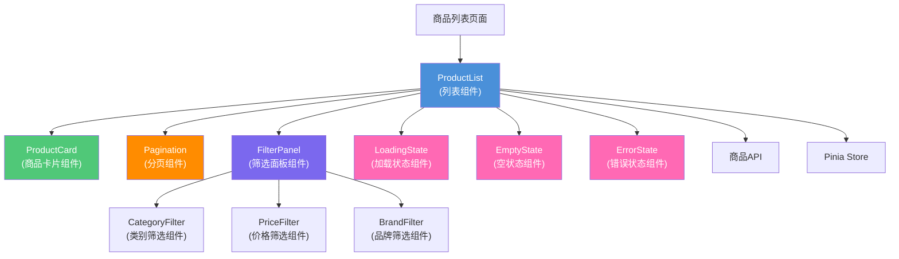

# 商品列表功能技术设计文档

> **关联需求**：[商品列表功能需求文档](../01-product-specs/product-listing-spec.md)  
> **文档状态**：草稿  
> **创建时间**：2026-06-16  
> **最后更新**：2026-06-16  
> **负责人**：@dev

---

## 概述

基于Vue 3 + Element Plus实现商品列表功能，采用响应式设计，支持分页加载、类别筛选、多条件筛选和状态处理，提供流畅的用户体验和良好的性能表现。

---

## 架构设计

### 组件关系图



### 数据流向

**初始化流程**：

1. 页面组件创建，从路由获取查询参数
2. 调用Vuex Action获取商品列表
3. Action调用API服务发送HTTP请求
4. 显示加载状态组件
5. 接收响应数据，更新Vuex State
6. 列表组件接收数据，渲染商品卡片
7. 隐藏加载状态，显示列表内容

**筛选流程**：

1. 用户选择筛选条件（类别、价格、品牌）
2. 筛选组件触发事件，传递筛选参数
3. 列表组件接收筛选参数，重置页码
4. 调用API服务，应用筛选条件
5. 显示加载状态
6. 接收筛选结果，更新列表
7. 更新URL查询参数（可选）

**分页流程**：

1. 用户点击分页控件
2. 分页组件触发页码变化事件
3. 列表组件接收新页码
4. 调用API服务，获取对应页数据
5. 显示加载状态
6. 接收响应数据，更新列表
7. 滚动到列表顶部

**错误处理流程**：

1. API请求失败
2. 错误拦截器捕获错误
3. 列表组件接收错误信息
4. 隐藏加载状态
5. 显示错误状态组件
6. 用户点击重试按钮
7. 重新发起请求

---

## 组件设计

### 1. ProductList（商品列表组件）

**Props**：

| 属性名 | 类型 | 必填 | 默认值 | 说明 |
|--------|------|------|--------|------|
| initialFilters | Object | 否 | {} | 初始筛选条件 |
| pageSize | Number | 否 | 10 | 每页显示数量 |

**Events**：

| 事件名 | 参数 | 说明 |
|--------|------|------|
| filter-change | filters | 筛选条件变化 |
| page-change | page | 页码变化 |

**State**：

| 状态名 | 类型 | 初始值 | 说明 |
|--------|------|--------|------|
| products | Array | [] | 商品列表 |
| loading | Boolean | false | 加载状态 |
| error | String | null | 错误信息 |
| pagination | Object | {} | 分页信息 |
| filters | Object | {} | 当前筛选条件 |

**Methods**：

```javascript
// 加载商品列表
async loadProducts(page = 1)

// 应用筛选条件
applyFilters(filters)

// 重置筛选条件
resetFilters()

// 处理重试
handleRetry()

// 处理商品点击
handleProductClick(product)
```

### 2. ProductCard（商品卡片组件）

**Props**：

| 属性名 | 类型 | 必填 | 默认值 | 说明 |
|--------|------|------|--------|------|
| product | Object | 是 | — | 商品数据 |
| showActions | Boolean | 否 | true | 是否显示操作按钮 |

**Events**：

| 事件名 | 参数 | 说明 |
|--------|------|------|
| click | product | 商品卡片点击 |

**Template结构**：

```vue
<template>
  <div class="product-card" @click="handleClick">
    <div class="product-image">
      
      <div class="product-badges">
        <span v-if="product.isNew" class="badge new">新品</span>
        <span v-if="product.isHot" class="badge hot">热销</span>
      </div>
    </div>
    <div class="product-info">
      <h3 class="product-name">{{ product.name }}</h3>
      <p class="product-desc">{{ product.description }}</p>
      <div class="product-price">
        <span class="current-price">¥{{ product.price }}</span>
        <span v-if="product.originalPrice" class="original-price">
          ¥{{ product.originalPrice }}
        </span>
      </div>
      <div class="product-meta">
        <span class="sales">已售{{ product.sales }}件</span>
        <span class="rating">评分{{ product.rating }}</span>
      </div>
    </div>
  </div>
</template>
```

### 3. FilterPanel（筛选面板组件）

**Props**：

| 属性名 | 类型 | 必填 | 默认值 | 说明 |
|--------|------|------|--------|------|
| categories | Array | 是 | [] | 商品类别列表 |
| brands | Array | 是 | [] | 品牌列表 |
| priceRanges | Array | 否 | [] | 价格区间 |

**Events**：

| 事件名 | 参数 | 说明 |
|--------|------|------|
| filter-change | filters | 筛选条件变化 |
| reset | — | 重置筛选 |

**Components**：

- `CategoryFilter`：类别筛选组件
- `PriceFilter`：价格筛选组件
- `BrandFilter`：品牌筛选组件

### 4. Pagination（分页组件）

**Props**：

| 属性名 | 类型 | 必填 | 默认值 | 说明 |
|--------|------|------|--------|------|
| currentPage | Number | 是 | 1 | 当前页码 |
| totalPages | Number | 是 | 1 | 总页数 |
| pageSize | Number | 否 | 10 | 每页数量 |

**Events**：

| 事件名 | 参数 | 说明 |
|--------|------|------|
| page-change | page | 页码变化 |

### 5. LoadingState（加载状态组件）

**Props**：

| 属性名 | 类型 | 必填 | 默认值 | 说明 |
|--------|------|------|--------|------|
| type | String | 否 | 'spinner' | 加载类型：spinner/skeleton |

### 6. EmptyState（空状态组件）

**Props**：

| 属性名 | 类型 | 必填 | 默认值 | 说明 |
|--------|------|------|--------|------|
| message | String | 否 | '暂无数据' | 空状态提示 |
| actionText | String | 否 | '返回首页' | 操作按钮文字 |

**Events**：

| 事件名 | 参数 | 说明 |
|--------|------|------|
| action | — | 操作按钮点击 |

### 7. ErrorState（错误状态组件）

**Props**：

| 属性名 | 类型 | 必填 | 默认值 | 说明 |
|--------|------|------|--------|------|
| message | String | 是 | — | 错误信息 |
| retryable | Boolean | 否 | true | 是否可重试 |

**Events**：

| 事件名 | 参数 | 说明 |
|--------|------|------|
| retry | — | 重试按钮点击 |

---

## 数据模型

### 商品数据模型

**Product**：

| 字段名 | 类型 | 说明 |
|--------|------|------|
| id | Number | 商品ID |
| name | String | 商品名称 |
| description | String | 商品描述 |
| image | String | 商品图片URL |
| price | Number | 当前价格 |
| originalPrice | Number | 原价 |
| category | String | 商品类别 |
| brand | String | 品牌 |
| sales | Number | 销量 |
| rating | Number | 评分 |
| isNew | Boolean | 是否新品 |
| isHot | Boolean | 是否热销 |
| stock | Number | 库存数量 |

### 筛选条件模型

**Filters**：

| 字段名 | 类型 | 说明 |
|--------|------|------|
| category | String | 商品类别 |
| brand | String | 品牌 |
| minPrice | Number | 最低价格 |
| maxPrice | Number | 最高价格 |
| sortBy | String | 排序字段 |
| sortOrder | String | 排序方向 |

### 分页信息模型

**Pagination**：

| 字段名 | 类型 | 说明 |
|--------|------|------|
| currentPage | Number | 当前页码 |
| totalPages | Number | 总页数 |
| totalElements | Number | 总记录数 |
| pageSize | Number | 每页数量 |

---

## API接口

### 获取商品列表

**接口**：`GET /api/v1/products`

**请求参数**：

```javascript
{
  page: 1,           // 页码
  size: 10,          // 每页数量
  category: '电子产品',  // 类别筛选
  brand: 'Apple',    // 品牌筛选
  minPrice: 100,     // 最低价格
  maxPrice: 500,     // 最高价格
  sortBy: 'price',   // 排序字段
  sortOrder: 'asc'   // 排序方向
}
```

**响应数据**：

```javascript
{
  code: 200,
  message: 'success',
  data: {
    content: [
      {
        id: 1,
        name: 'iPhone 15',
        description: '最新款智能手机',
        image: 'https://example.com/image.jpg',
        price: 5999,
        originalPrice: 6999,
        category: '电子产品',
        brand: 'Apple',
        sales: 1000,
        rating: 4.8,
        isNew: true,
        isHot: true,
        stock: 100
      }
    ],
    pageable: {
      pageNumber: 1,
      pageSize: 10,
      totalPages: 5,
      totalElements: 50
    }
  }
}
```

### 获取商品类别

**接口**：`GET /api/v1/categories`

**响应数据**：

```javascript
{
  code: 200,
  message: 'success',
  data: [
    { id: 1, name: '电子产品', count: 100 },
    { id: 2, name: '服装', count: 200 },
    { id: 3, name: '食品', count: 150 }
  ]
}
```

---

## 响应式设计

### 断点定义

```scss
$breakpoints: (
  xs: 320px,   // 超小屏幕
  sm: 576px,   // 小屏幕
  md: 768px,   // 中等屏幕
  lg: 992px,   // 大屏幕
  xl: 1200px,  // 超大屏幕
  xxl: 1400px  // 超超大屏幕
);
```

### 布局适配

**桌面端（≥ 992px）**：
- 每行显示4个商品卡片
- 筛选面板在左侧固定
- 分页控件在底部居中

**平板端（768px - 991px）**：
- 每行显示3个商品卡片
- 筛选面板可折叠
- 分页控件自适应

**移动端（< 768px）**：
- 每行显示2个商品卡片
- 筛选面板默认隐藏，点击展开
- 分页控件简化显示
- 商品信息简化

### CSS实现

```scss
.product-list {
  display: grid;
  gap: 20px;
  
  // 桌面端
  @media (min-width: 992px) {
    grid-template-columns: repeat(4, 1fr);
  }
  
  // 平板端
  @media (min-width: 768px) and (max-width: 991px) {
    grid-template-columns: repeat(3, 1fr);
  }
  
  // 移动端
  @media (max-width: 767px) {
    grid-template-columns: repeat(2, 1fr);
    gap: 10px;
  }
}
```

---

## 性能优化

### 1. 虚拟滚动

对于大量商品列表，使用虚拟滚动只渲染可见区域的商品卡片。

```javascript
import { RecycleScroller } from 'vue-virtual-scroller'

<RecycleScroller
  :items="products"
  :item-size="300"
  key-field="id"
>
  <template #default="{ item }">
    <ProductCard :product="item" />
  </template>
</RecycleScroller>
```

### 2. 图片懒加载

使用Intersection Observer实现图片懒加载。

```javascript
const lazyLoadImage = (image) => {
  const observer = new IntersectionObserver((entries) => {
    entries.forEach(entry => {
      if (entry.isIntersecting) {
        const img = entry.target
        img.src = img.dataset.src
        observer.unobserve(img)
      }
    })
  })
  
  observer.observe(image)
}
```

### 3. 防抖和节流

对筛选输入和滚动事件进行防抖和节流处理。

```javascript
import { debounce } from 'lodash-es'

const handleSearch = debounce((keyword) => {
  applyFilters({ keyword })
}, 300)
```

### 4. 请求缓存

对相同的筛选条件进行请求结果缓存。

```javascript
const cache = new Map()

async function loadProducts(filters) {
  const cacheKey = JSON.stringify(filters)
  
  if (cache.has(cacheKey)) {
    return cache.get(cacheKey)
  }
  
  const result = await api.getProducts(filters)
  cache.set(cacheKey, result)
  
  // 5分钟后清除缓存
  setTimeout(() => cache.delete(cacheKey), 5 * 60 * 1000)
  
  return result
}
```

---

## 风险与注意事项

### 技术风险

| 风险 | 影响程度 | 概率 | 应对策略 |
|------|----------|------|----------|
| 大量数据渲染性能问题 | 高 | 中 | 虚拟滚动、分页加载 |
| 图片加载缓慢 | 中 | 高 | 图片懒加载、CDN加速 |
| 筛选条件过多导致性能下降 | 中 | 中 | 防抖处理、请求缓存 |
| 移动端适配问题 | 低 | 中 | 响应式设计、测试覆盖 |

### 注意事项

1. **性能监控**：监控页面加载时间和交互响应时间
2. **错误边界**：使用错误边界组件捕获组件错误
3. **内存管理**：及时清理不再使用的数据和事件监听
4. **SEO优化**：服务端渲染或预渲染提升SEO
5. **可访问性**：遵循WCAG 2.1标准，支持键盘导航
6. **测试覆盖**：单元测试、集成测试、E2E测试

---

## 测试策略

| 测试类型 | 测试内容 | 测试框架 | 覆盖场景 |
|----------|---------|----------|----------|
| 组件单元测试 | 组件渲染、事件处理 | Jest + Vue Test Utils | 正常流程、边界条件 |
| 集成测试 | 组件间交互、API调用 | Jest + axios-mock-adapter | 完整业务流程 |
| 响应式测试 | 不同屏幕尺寸适配 | Cypress + Device Mode | 移动端、平板、桌面 |
| 性能测试 | 渲染性能、加载时间 | Lighthouse | 首屏加载、交互响应 |
| E2E测试 | 端到端用户流程 | Cypress | 筛选、分页、查看详情 |

---

## 变更记录

| 版本 | 日期 | 变更内容 | 变更人 |
|------|------|----------|--------|
| v1.0 | 2026-06-16 | 初始版本 | @dev |