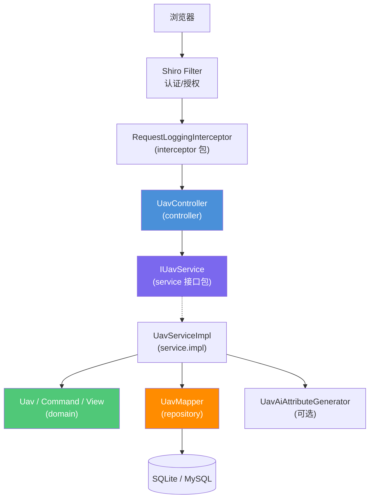

# 无人机信息管理 技术设计文档

**关联需求**：`../01-product-specs/uav-management-spec.md`  
**文档状态**：草稿  
**创建时间**：2026-04-24  
**最后更新**：2026-05-06  
**负责人**：@dev

---

## 概述

本系统实现**无人机资产台账**管理，覆盖录入、条件查询、分页列表、详情查看、修改、删除等基本操作。技术栈遵循 **Java EE 8 / Servlet 3.0 + Spring Boot 2.2.x + Apache Shiro 1.7 + MyBatis 3.5.x**，视图层采用 **Thymeleaf 3.0.x + Bootstrap 3.3.7**，交互与目录结构**参考若依（RuoYi）**的管理端风格。持久层使用 **Druid** 数据源与 **Hibernate Validation** 做入参校验；支持 **SQLite（默认）与 MySQL** 通过配置切换。

业务实现采用标准四层架构：**controller → service（接口/实现分包）→ repository（Mapper 接口与 XML/注解分离策略）→ domain**，禁止跨层调用。横切能力：**Shiro** 负责认证与授权；独立 **`interceptor` 包**内放置 MVC 拦截器，统一打印请求与耗时；配置尽量使用 **Java 配置与注解**，减少 XML（MyBatis 映射可在资源目录保留最小 XML 或使用注解 Mapper）。

---

## 技术栈与约束（与需求对齐）

| 类别 | 选型 | 说明 |
|------|------|------|
| 运行环境 | Java EE 8、Servlet 3.0 | 与 Spring Boot 2.2 嵌入式容器一致 |
| 构建 | Apache Maven 3 | 统一依赖与 profile（如 `sqlite` / `mysql`） |
| 应用框架 | Spring Boot 2.2.x、Spring Framework 5.2.x | 主框架版本锁定 |
| 安全 | Apache Shiro 1.7 | Filter 链、会话、角色/权限（可渐进增强） |
| 持久化 | MyBatis 3.5.x、Alibaba Druid 1.2.x | Mapper + Druid 连接池 |
| 校验 | Hibernate Validation 6.0.x | Controller/Form 与 DTO 上使用 `@Valid` |
| 视图 | Thymeleaf 3.0.x、Bootstrap 3.3.7 | 服务端渲染管理页 |
| 数据库 | SQLite、MySQL | 同一套领域模型，切换数据源与方言策略 |

---

## 业务功能：基本操作矩阵

以下操作均在**登录后**的管理权限下执行（初期可收缩为单管理员角色）。

| 操作 | 用户意图 | 页面/入口 | 服务端行为概要 |
|------|----------|-----------|----------------|
| **列表（分页）** | 浏览台账 | 菜单「无人机管理」→ 列表页 | 分页查询，默认按更新时间倒序 |
| **条件查询** | 按编号/型号/状态等筛选 | 列表页查询表单 | 动态 SQL（MyBatis）多条件 AND，关键字可为空则忽略 |
| **详情** | 查看单条完整信息 | 列表「详情」或行点击 | 按 ID 查询，不存在则 404/友好错误页 |
| **新增** | 录入无人机 | 「新增」按钮 → 表单页 | 校验通过后插入；编号唯一；可选 AI 属性补全（见需求） |
| **修改** | 更新台账字段 | 列表「编辑」→ 表单页 | 乐观校验 ID 存在；更新 `updated_at` |
| **删除** | 移除一条记录 | 列表「删除」+ 确认 | 物理删除（与当前需求一致）；可后续迭代逻辑删除 |
| **（可选）导出** | 导出当前筛选结果 | 若依常见「导出」按钮 | **本期可不做**，预留接口或按钮位 |

**与若依的对应关系**：左侧菜单模块、列表页顶栏（查询/重置/新增）、表格操作列（详情/编辑/删除）、表单页「确定/返回」，保持管理员熟悉的操作路径。

---

## 架构设计

### 组件关系图



### 分层与包结构（接口与实现分离）

约定根包 `com.example.uav`（实现时替换为项目实际包名）：

| 层级 | 包路径 | 说明 |
|------|--------|------|
| Controller | `...controller` | 仅依赖 Service **接口** |
| Service 接口 | `...service` | `IUavService` 等 |
| Service 实现 | `...service.impl` | `UavServiceImpl`，加 `@Service` |
| Domain | `...domain` | 实体、枚举、表单/DTO（与 Thymeleaf 绑定对象） |
| Repository | `...repository` | MyBatis `Mapper` 接口；**XML 放在 `resources/mapper`**，或纯注解 Mapper |
| Config | `...config` | `DataSource`、`MyBatis`、`Shiro`、`WebMvc`（注册拦截器） |
| Interceptor | `...interceptor` | `HandlerInterceptor` 实现类，专包存放 |
| Common/Exception | `...common`、`...exception` | 统一异常、常量 |

**依赖方向**：controller → service 接口 → service.impl → repository、domain；**禁止** controller 直接注入 Mapper。

### 数据流向

**请求处理流程**：

1. 请求经 Shiro 过滤器链（匿名静态资源、登录页、`/uav/**` 需认证）。
2. MVC 拦截器记录方法、URI、QueryString、客户端 IP、耗时、（若已登录）主体标识。
3. Controller 接收参数，`@Valid` 校验表单/DTO，调用 `IUavService`。
4. Service 实现事务边界与业务规则（编号唯一、状态合法等），调用 `UavMapper`。
5. MyBatis 访问数据库；SQLite/MySQL 由统一 DataSource 注入。
6. 返回视图名与 Model，Thymeleaf 渲染；异常由全局处理器映射为错误页或 Flash 消息。

**异常处理流程**：业务异常 → 统一处理 → 列表/表单回显错误信息；系统异常 → 日志 + 通用错误页。

---

## 数据模型

### 实体（Domain）

`Uav` 核心字段（可与需求文档迭代对齐）：

| 字段名 | 类型 | 说明 |
|--------|------|------|
| id | Long | 主键 |
| code | String | 无人机编号（唯一） |
| model | String | 型号 |
| manufacturer | String | 厂商 |
| maxFlightTimeMinutes | Integer | 最大续航（分钟） |
| maxRangeKm | Integer | 最大航程（km） |
| payloadKg | Integer | 载重（kg） |
| status | String/Enum | 状态：如 ACTIVE、INACTIVE、MAINTENANCE |
| remark | String | 备注（可选，若依式表单常见） |
| createdAt | LocalDateTime | 创建时间 |
| updatedAt | LocalDateTime | 更新时间 |

列表查询可扩展：创建时间区间（后续迭代）。

### 表结构（SQLite / MySQL 兼容策略）

- 主键：MySQL `AUTO_INCREMENT`，SQLite `INTEGER PRIMARY KEY AUTOINCREMENT`，可通过 MyBatis 方言或两套装载脚本（`schema-sqlite.sql` / `schema-mysql.sql`）初始化。
- 时间字段：应用层写入 `LocalDateTime`，避免数据库函数方言分裂（简化跨库）。
- 唯一约束：`code` 唯一索引。

示例（MySQL）：

```sql
CREATE TABLE uav (
  id BIGINT PRIMARY KEY AUTO_INCREMENT,
  code VARCHAR(64) NOT NULL,
  model VARCHAR(128) NOT NULL,
  manufacturer VARCHAR(128) NOT NULL,
  max_flight_time_minutes INT,
  max_range_km INT,
  payload_kg INT,
  status VARCHAR(32) NOT NULL,
  remark VARCHAR(512),
  created_at DATETIME NOT NULL,
  updated_at DATETIME NOT NULL,
  UNIQUE KEY uk_uav_code (code)
);
```

---

## 数据源与切换策略

- 配置项：如 `spring.profiles.active` 或自定义 `app.db.type=sqlite|mysql`。
- 使用 **Druid** `DataSource`，URL、驱动类、用户名密码分环境配置。
- MyBatis：`mapper-locations` 指向 `classpath:mapper/**/*.xml`；`type-aliases-package` 指向 domain 包。
- 切换数据库仅改配置与初始化脚本，**不改 Java 业务代码**。

---

## 路由与页面（Thymeleaf）

若依风格路径建议（可按模块前缀统一 `/system/uav` 或简化为 `/uav`）：

| 方法 | 路径 | 说明 |
|------|------|------|
| GET | `/uav` | 分页列表 + 查询条件 |
| GET | `/uav/add` | 新增页 |
| POST | `/uav` | 提交新增 |
| GET | `/uav/{id}` | 详情页 |
| GET | `/uav/edit/{id}` | 编辑页 |
| POST | `/uav/update` | 提交更新（可带隐藏域 id） |
| POST | `/uav/remove/{id}` | 删除（POST 防误触，符合传统表单） |

后续若增加 REST API，可并行增加 `/api/uavs` 等资源路径，与页面控制器分离。

---

## 拦截器设计（独立包）

包：`...interceptor`。

- **RequestLoggingInterceptor**：`preHandle`/`afterCompletion` 记录开始时间与线程本地变量；打印 **HTTP 方法、请求 URI、queryString、RemoteAddr、User-Agent（可选）、耗时 ms**；若 Shiro Subject 已认证，打印 **用户名**。
- 注册方式：`WebMvcConfigurer#addInterceptors`，拦截 `/uav/**` 及管理端其他业务路径（排除静态资源与登录页）。

---

## Shiro 安全设计（最小可用 → 可扩展）

- **最小可用**：内存 Realm 或单表用户；`/login` 匿名；静态资源匿名；`/uav/**` 需 `authc`。
- **扩展**：JdbcRealm / 自定义 Realm；角色 `admin`、`operator`；后续可为「删除」单独权限字。
- 与 Spring Boot 集成：Shiro Filter FactoryBean、过滤器顺序需在文档实现阶段与 Spring Security 互斥（本项目选用 Shiro，不混用 Security）。

---

## 注解与 XML 使用原则

- **Spring / MVC / Validation / Shiro**：优先注解配置（`@Configuration`、`@RequiresPermissions` 若引入权限字等）。
- **MyBatis**：Mapper 接口 + **`@Mapper`**；复杂动态 SQL 可用 **XML** 集中维护（减少 Java 字符串拼接），放置 `resources/mapper/UavMapper.xml`。
- **无 web.xml**：Servlet 3.0+ 嵌入式容器，依赖 Spring Boot 自动配置。

---

## 测试策略

| 测试类型 | 测试类 | 框架 | 覆盖场景 |
|----------|--------|------|----------|
| Service 单元测试 | `UavServiceImplTest` | Mockito + JUnit 5 | CRUD 规则、编号重复、记录不存在 |
| Controller 切片测试 | `UavControllerTest` | `@WebMvcTest` + `@MockBean` | 校验失败、视图名、重定向 |
| 集成测试（少量） | `UavSqliteIT` | `@SpringBootTest` | SQLite 下完整 CRUD |

执行：`mvn clean verify -Pharness-new`（与项目门禁一致）。

---

## 风险与注意事项

| 项目 | 说明 |
|------|------|
| 跨库 SQL | 分页与函数避免使用单一数据库专有语法；分页插件需与双库策略一致。 |
| Shiro 与 Spring Boot 2.2 | 注意 Filter 顺序与静态资源放行，避免拦截 CSS/JS。 |
| 编号唯一 | 并发新增需在 Service 层捕获唯一索引冲突并转为友好提示。 |

---

## 变更记录

| 版本 | 日期 | 变更内容 | 变更人 |
|------|------|----------|--------|
| v1.0 | 2026-04-24 | 初始版本 | @dev |
| v1.1 | 2026-05-06 | 对齐 req1 技术栈；补充基本操作矩阵、包结构、若依式路由与拦截器/Shiro 细化 | @dev |
