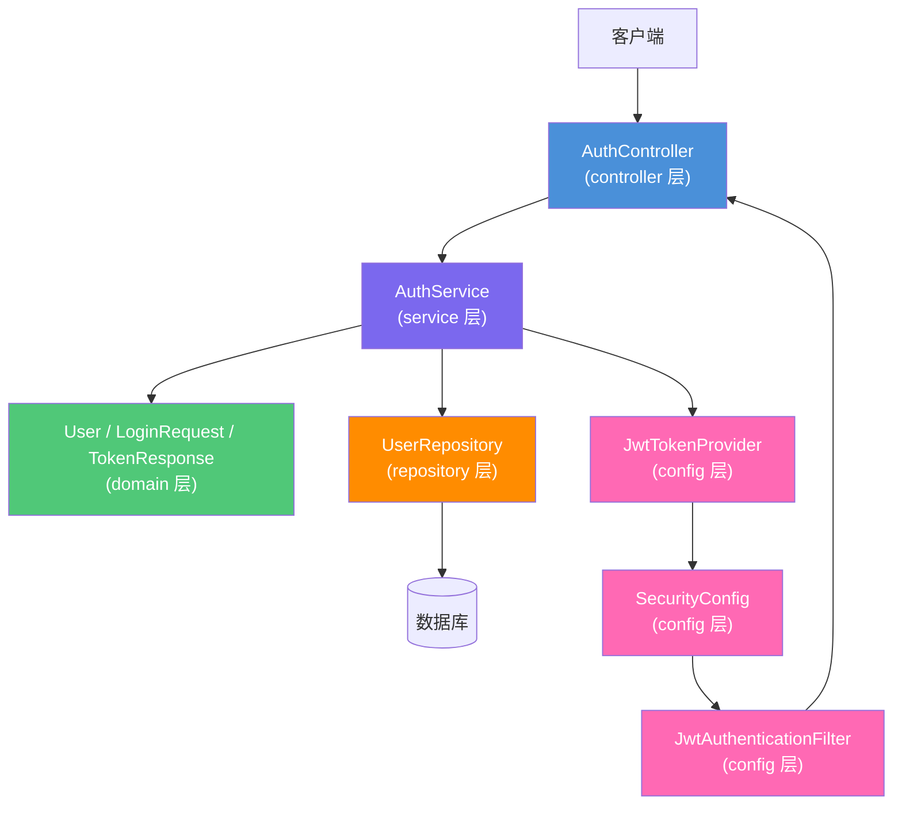

# 用户认证系统技术设计文档

> **关联需求**：[用户认证系统需求文档](../01-product-specs/user-authentication-spec.md)  
> **文档状态**：草稿  
> **创建时间**：2026-06-16  
> **最后更新**：2026-06-16  
> **负责人**：@dev

---

## 概述

基于Spring Security + JWT实现用户认证系统，采用标准四层架构，通过JWT令牌进行无状态身份认证，支持令牌刷新和会话管理，遵循安全最佳实践防止常见安全漏洞。

---

## 架构设计

### 组件关系图



### 数据流向

**请求处理流程**：

1. 客户端发送登录请求到 `AuthController`
2. Controller 接收登录参数，调用参数校验（`@Valid`）
3. Controller 将 `LoginRequest` 传递给 `AuthService`
4. Service 验证用户凭据，调用 `UserRepository` 查询用户
5. Repository 与数据库交互，返回用户实体
6. Service 验证密码（BCrypt），生成JWT令牌
7. Service 构造 `TokenResponse`，包含访问令牌和刷新令牌
8. Controller 将 `TokenResponse` 包装为统一响应格式返回

**JWT验证流程**：

1. 客户端请求携带JWT令牌
2. `JwtAuthenticationFilter` 拦截请求，提取令牌
3. `JwtTokenProvider` 验证令牌签名和有效期
4. 验证通过后，设置Spring Security上下文
5. 请求继续到达Controller，正常处理

**异常处理流程**：

1. Service 或 Repository 抛出业务异常（`AuthenticationException`）
2. 全局异常处理器（`GlobalExceptionHandler`）捕获异常
3. 返回标准错误响应格式（401/403）

---

## 接口定义

### REST API

**基础路径**：`/api/v1/auth`

| 方法 | 路径 | 描述 | 认证 | 请求体 | 响应体 |
|------|------|------|------|--------|--------|
| POST | `/api/v1/auth/login` | 用户登录 | 不需要 | `LoginRequest` | `TokenResponse` |
| POST | `/api/v1/auth/refresh` | 刷新令牌 | 不需要 | `RefreshTokenRequest` | `TokenResponse` |
| POST | `/api/v1/auth/logout` | 用户登出 | 需要 | — | `SuccessResponse` |
| GET | `/api/v1/auth/me` | 获取当前用户信息 | 需要 | — | `UserInfoResponse` |

#### 接口详情：POST /api/v1/auth/login

**描述**：用户使用用户名和密码登录系统

**请求体**：

```json
{
  "username": "user@example.com",
  "password": "SecurePassword123!"
}
```

**请求体字段说明**：

| 字段名 | 类型 | 必填 | 校验规则 | 描述 |
|--------|------|------|----------|------|
| username | String | 是 | @NotBlank, @Email | 用户名（邮箱） |
| password | String | 是 | @NotBlank, @Size(min=8) | 密码（最少8位） |

**响应示例（200 OK）**：

```json
{
  "code": 200,
  "message": "登录成功",
  "data": {
    "accessToken": "eyJhbGciOiJSUzI1NiIsInR5cCI6IkpXVCJ9...",
    "refreshToken": "eyJhbGciOiJSUzI1NiIsInR5cCI6IkpXVCJ9...",
    "tokenType": "Bearer",
    "expiresIn": 1800
  }
}
```

**错误响应示例（401 Unauthorized）**：

```json
{
  "code": 401,
  "message": "用户名或密码错误",
  "data": null
}
```

#### 接口详情：POST /api/v1/auth/refresh

**描述**：使用刷新令牌获取新的访问令牌

**请求体**：

```json
{
  "refreshToken": "eyJhbGciOiJSUzI1NiIsInR5cCI6IkpXVCJ9..."
}
```

**响应示例（200 OK）**：

```json
{
  "code": 200,
  "message": "令牌刷新成功",
  "data": {
    "accessToken": "eyJhbGciOiJSUzI1NiIsInR5cCI6IkpXVCJ9...",
    "refreshToken": "eyJhbGciOiJSUzI1NiIsInR5cCI6IkpXVCJ9...",
    "tokenType": "Bearer",
    "expiresIn": 1800
  }
}
```

#### 接口详情：POST /api/v1/auth/logout

**描述**：用户登出，撤销刷新令牌

**请求头**：

```
Authorization: Bearer {accessToken}
```

**响应示例（200 OK）**：

```json
{
  "code": 200,
  "message": "登出成功",
  "data": null
}
```

#### 接口详情：GET /api/v1/auth/me

**描述**：获取当前登录用户的信息

**请求头**：

```
Authorization: Bearer {accessToken}
```

**响应示例（200 OK）**：

```json
{
  "code": 200,
  "message": "success",
  "data": {
    "id": 1,
    "username": "user@example.com",
    "nickname": "张三",
    "roles": ["USER"],
    "createdAt": "2026-06-01T00:00:00Z"
  }
}
```

---

## 数据模型

### 实体类

**`User` 实体类**（对应表：`t_user`）：

| 字段名 | Java 类型 | 数据库类型 | 约束 | 说明 |
|--------|-----------|-----------|------|------|
| id | Long | BIGINT | PK, AUTO_INCREMENT | 主键 |
| username | String | VARCHAR(100) | NOT NULL, UNIQUE | 用户名（邮箱） |
| password | String | VARCHAR(255) | NOT NULL | 密码（BCrypt加密） |
| nickname | String | VARCHAR(50) | NULL | 昵称 |
| roles | String | VARCHAR(255) | NOT NULL | 角色（逗号分隔） |
| status | String | VARCHAR(20) | NOT NULL | 状态：ACTIVE/LOCKED/DISABLED |
| failedAttempts | Integer | INT | NOT NULL, DEFAULT 0 | 登录失败次数 |
| lockedUntil | LocalDateTime | DATETIME | NULL | 锁定到期时间 |
| createdAt | LocalDateTime | DATETIME | NOT NULL | 创建时间 |
| updatedAt | LocalDateTime | DATETIME | NOT NULL | 更新时间 |
| deleted | Boolean | TINYINT(1) | NOT NULL, DEFAULT 0 | 逻辑删除标志 |

### DTO

**`LoginRequest`（登录请求 DTO）**：

| 字段名 | Java 类型 | 校验注解 | 说明 |
|--------|-----------|---------|------|
| username | String | @NotBlank, @Email | 用户名 |
| password | String | @NotBlank, @Size(min=8) | 密码 |

**`TokenResponse`（令牌响应 DTO）**：

| 字段名 | Java 类型 | 说明 |
|--------|-----------|------|
| accessToken | String | JWT访问令牌 |
| refreshToken | String | JWT刷新令牌 |
| tokenType | String | 令牌类型（Bearer） |
| expiresIn | Long | 访问令牌过期时间（秒） |

**`UserInfoResponse`（用户信息响应 DTO）**：

| 字段名 | Java 类型 | 来源字段 | 说明 |
|--------|-----------|---------|------|
| id | Long | entity.id | 用户ID |
| username | String | entity.username | 用户名 |
| nickname | String | entity.nickname | 昵称 |
| roles | List<String> | entity.roles（解析） | 角色列表 |
| createdAt | String | entity.createdAt（格式化） | 创建时间 |

### 数据库表结构

```sql
CREATE TABLE `t_user` (
    `id`               BIGINT       NOT NULL AUTO_INCREMENT COMMENT '主键',
    `username`         VARCHAR(100) NOT NULL                COMMENT '用户名（邮箱）',
    `password`         VARCHAR(255) NOT NULL                COMMENT '密码（BCrypt加密）',
    `nickname`         VARCHAR(50)                          COMMENT '昵称',
    `roles`            VARCHAR(255) NOT NULL DEFAULT 'USER'  COMMENT '角色（逗号分隔）',
    `status`           VARCHAR(20)  NOT NULL DEFAULT 'ACTIVE' COMMENT '状态：ACTIVE/LOCKED/DISABLED',
    `failed_attempts`  INT          NOT NULL DEFAULT 0       COMMENT '登录失败次数',
    `locked_until`     DATETIME                             COMMENT '锁定到期时间',
    `created_at`       DATETIME     NOT NULL DEFAULT CURRENT_TIMESTAMP COMMENT '创建时间',
    `updated_at`       DATETIME     NOT NULL DEFAULT CURRENT_TIMESTAMP ON UPDATE CURRENT_TIMESTAMP COMMENT '更新时间',
    `deleted`          TINYINT(1)   NOT NULL DEFAULT 0       COMMENT '逻辑删除：0-正常，1-已删除',
    PRIMARY KEY (`id`),
    UNIQUE KEY `uk_username` (`username`),
    INDEX `idx_status` (`status`)
) ENGINE=InnoDB DEFAULT CHARSET=utf8mb4 COMMENT='用户表';
```

---

## 技术选型

| 技术 | 版本 | 用途 | 选择理由 |
|------|------|------|----------|
| Spring Boot | 3.x | 应用框架 | 项目统一技术栈，提供自动配置 |
| Spring Security | 6.x | 安全框架 | 提供认证和授权基础支持 |
| JWT (jjwt) | 0.11.x | 令牌生成和验证 | 支持RS256签名，API简洁易用 |
| BCrypt | - | 密码加密 | Spring Security内置，安全性高 |
| MyBatis Plus | 3.x | 数据访问层 | 简化CRUD操作，支持分页查询 |
| Lombok | 1.18.x | 代码简化 | 减少样板代码 |
| Validation | 3.x | 参数校验 | 支持声明式校验，减少重复代码 |

---

## 安全设计

### JWT令牌设计

**访问令牌（Access Token）**：
- 算法：RS256（非对称加密）
- 有效期：30分钟
- 包含信息：用户ID、用户名、角色、过期时间、签发时间

**刷新令牌（Refresh Token）**：
- 算法：RS256
- 有效期：7天
- 存储位置：数据库（关联用户ID）
- 用途：获取新的访问令牌

**JWT Payload示例**：

```json
{
  "sub": "1",
  "username": "user@example.com",
  "roles": ["USER"],
  "jti": "unique-token-id",
  "iat": 1700000000,
  "exp": 1700001800
}
```

### 密码安全

- 加密算法：BCrypt
- 强度因子：10（默认）
- 存储方式：数据库存储BCrypt哈希值

### 防护措施

1. **防SQL注入**：使用MyBatis Plus参数化查询
2. **防XSS攻击**：输入验证和输出编码
3. **防CSRF攻击**：JWT无状态，天然防护
4. **防暴力破解**：登录失败5次锁定15分钟
5. **令牌安全**：HTTPS传输，不在URL中传递

---

## 风险与注意事项

### 技术风险

| 风险 | 影响程度 | 概率 | 应对策略 |
|------|----------|------|----------|
| JWT令牌被窃取 | 高 | 低 | 使用HTTPS，设置合理过期时间，支持令牌撤销 |
| 密码数据库泄露 | 高 | 低 | BCrypt加密，即使泄露也无法还原明文 |
| 并发登录冲突 | 中 | 中 | 同一用户允许多设备登录，通过刷新令牌管理 |
| 时钟同步问题 | 中 | 低 | 令牌有效期设置合理缓冲时间 |

### 注意事项

1. **密钥管理**：RSA密钥对必须安全存储，私钥不能泄露
2. **令牌刷新**：刷新令牌必须存储在数据库，支持撤销
3. **会话管理**：JWT无状态，通过数据库记录活跃会话
4. **错误处理**：认证失败不透露具体错误信息（如"用户不存在"）
5. **日志记录**：记录登录、登出、令牌刷新等关键操作
6. **并发安全**：登录失败计数需要原子操作

---

## 测试策略

| 测试类型 | 测试类 | 测试框架 | 覆盖场景 |
|----------|--------|----------|----------|
| Service 单元测试 | `AuthServiceTest` | Mockito | 正常登录、密码错误、账户锁定、令牌生成 |
| Controller 切片测试 | `AuthControllerTest` | @WebMvcTest | 参数校验、响应格式、异常处理 |
| Repository 切片测试 | `UserRepositoryTest` | @DataJpaTest | 用户查询、更新、锁定状态 |
| 集成测试 | `AuthIntegrationTest` | @SpringBootTest | 完整登录流程、令牌验证、刷新流程 |

---

## 变更记录

| 版本 | 日期 | 变更内容 | 变更人 |
|------|------|----------|--------|
| v1.0 | 2026-06-16 | 初始版本 | @dev |